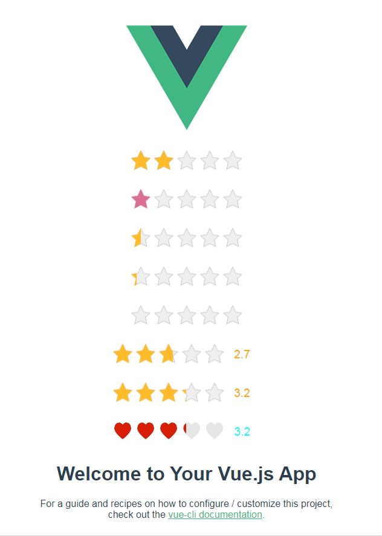

# RateStar for Vue

  

# Usage

```html

<!-- RateStar 整数 -->
<div>
    <RateStar :value='2'/>
</div>
<!-- 自定义颜色 -->
<div>
    <RateStar :value='1' activeColor="palevioletred"/>
</div>
<!-- 半星 -->
<div>
    <RateStar :value='.5' allowHalf/>
</div>
<!-- 小数 -->
<div>
    <RateStar :value='.3' allowDecimal/>
</div>
<!-- 小数，自定义颜色 -->
<div>
    <RateStar allowDecimal allowHalf activeColor="cyan"/>
</div>
<!-- RateStarBar 带分数，双向绑定 -->
<div>
    <RateStarBar v-model="score" />
</div>
<!-- 只读 -->
<div>
    <RateStarBar :value="3.2" :readOnly="true" />
</div>
<!-- 你可能注意到了，自定义图片时，就不能自定义颜色了，暂时没有优雅的办法解决，一般场景也足够用了 -->
<div>
    <RateStarBar :value="3.2" :readOnly="false" activeColor="cyan" :defaultImage="require('./assets/heart.svg')" :activeImage="require('./assets/heart2.svg')" :maskImage="require('./assets/heart2.svg')" />
</div>

```

# License
MIT